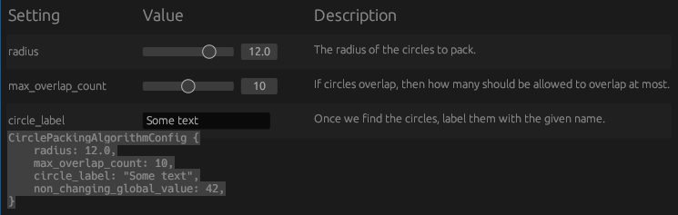

# egui-controls

`egui-controls` is a Rust library that provides a `ControlPanel` proc-macro to generate a simple control panel interface using the [egui](https://github.com/emilk/egui) immediate mode graphical user interface library.

## Motivation
You're implementing a Rust algorithm that has various tunable parameters, and would like to inspect the output by
tweaking the parameters in real-time.

## Usage

```sh
cargo add egui-controls
```

## Example

Suppose your typical config data that contains the parameters for the algorithm looks like this:

```rust
#[derive(Debug, Clone)]
pub struct CirclePackingAlgorithmConfig {
    /// The radius of the circles to pack.
    pub radius: f64,
    /// If circles overlap, then how many should be allowed 
    /// to overlap at most.
    pub max_overlap_count: usize,
    /// Once we find the circles, label them with the
    /// given name.
    pub circle_label: String,
    /// Some global constant that should definitely only take on this value.
    pub non_changing_global_value: i8
}

/// Some initial values for the config that make sense.
impl Default for CirclePackingAlgorithmConfig {
    fn default() -> Self {
        Self {
            radius: 12.0,
            max_overlap_count: 10,
            circle_label: "Some text".to_string(),
            non_changing_global_value: 42
        }
    }
}
```

Now, just derive [egui_controls::ControlPanel](https://github.com/aalekhpatel07/egui-controls/blob/main/src/lib.rs) for your data, and
sprinkle in some `#[control]` attributes on the fields you'd like to be interactive in the UI:
```diff
+ use egui_controls::ControlPanel;

- #[derive(Debug, Clone)]
+ #[derive(Debug, Clone, ControlPanel)]
pub struct CirclePackingAlgorithmConfig {
    /// The radius of the circles to pack.
+   #[control(slider(2. ..= 15.0))]
    pub radius: f64,
    /// If circles overlap, then how many should be allowed 
    /// to overlap at most.
+   #[control(slider(0 ..= 20))]
    pub max_overlap_count: usize,
    /// Once we find the circles, label them with the
    /// given name.
+   #[control(textbox)]
    pub circle_label: String,
    /// Some global constant that should definitely only take on this value.
    pub non_changing_global_value: i8
}
```
Now, use `config.ui(ui)` to embed that in any UI section you're building with `eframe::egui`.
```rust
use eframe::{egui, Frame};

#[derive(Debug, Clone, Default)]
pub struct MyApp {
    settings: CirclePackingAlgorithmConfig
}

impl eframe::App for MyApp {
    fn update(&mut self, ctx: &egui::Context, _frame: &mut Frame) {
        egui::CentralPanel::default().show(ctx, |ui: &mut egui::Ui| {
            // Embed the settings panel
            // directly into your ui.
            self.settings.ui(ui);
            // Add this the struct's debug repr if you want
            // to see the values getting updated as you tweak
            // the settings via the ui.
            ui.vertical(|ui| {
                ui.code(format!("{:#?}", &self.settings));
            });
        });
    }
}

// Write the usual eframe entrypoint.
pub fn main() {
    let options = ::eframe::NativeOptions {
        resizable: true,
        initial_window_size: Some(::eframe::egui::vec2(2000.0, 500.0)),
        ..Default::default()
    };
    let app = MyApp::default();
    ::eframe::run_native("readme", options, Box::new(|_| Box::new(app))).unwrap();
}
```
## Output

This generates a simple control panel interface for the `CirclePackingAlgorithmConfig`
and we can tune the values via the sliders.

Note: You can run the `readme` example to generate the same output.


